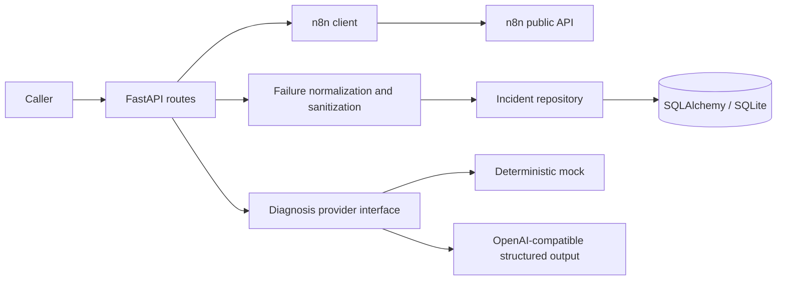

# FlowMedic AI

FlowMedic turns failed n8n workflow executions into persistent incidents and structured,
uncertainty-aware diagnosis suggestions. Phase 1 is a backend MVP for one trusted n8n
instance. It does not modify workflows or apply fixes.

## Public demo mode

The highest-value Phase 2 increment is a credentials-free, reproducible API demo. It seeds
one fixed **synthetic** workflow failure, persists it, and produces a deterministic mock
diagnosis through the same incident and diagnosis path used by the service. It never contacts
n8n or an AI provider, and it must not be used with `N8N_API_KEY` or `AI_API_KEY`.

```bash
DEMO_MODE=true DATABASE_URL=sqlite:///./flowmedic-demo.db \
  python -m uvicorn app.main:app --host 127.0.0.1 --port 8000 --no-access-log
```

Open `http://127.0.0.1:8000/` for the service entry point, `http://127.0.0.1:8000/docs`
for the interactive OpenAPI demo, or call:

```bash
curl http://127.0.0.1:8000/api/v1/demo
curl http://127.0.0.1:8000/api/v1/incidents
```

For a public deployment, use a dedicated demo database and synthetic-only environment;
do not expose a live n8n configuration or production incident database. The demo makes the
architecture and safety boundaries inspectable, but it is not clinical software and the
diagnosis is an advisory mock response.

## Phase 1 capabilities

- Check n8n API connectivity and list workflow summaries.
- Inspect recent execution pages and identify `error` / `crashed` executions.
- Fetch details for failed executions and older responses that omit status.
- Normalize failures into sanitized incidents; repeated syncs do not duplicate incidents.
- Persist incidents and their latest diagnosis in SQLAlchemy/SQLite.
- Use a deterministic mock without an AI key, or a configurable OpenAI-compatible
  chat completions provider that supports strict JSON schema output.
- Expose typed FastAPI endpoints, bounded pagination, consistent errors and optional bearer auth.

## Architecture



```text
app/
  api/                 HTTP routes and dependencies
  core/                Settings, database, safe errors, sanitization
  integrations/n8n/    Upstream schemas, client, failure detection
  models/              SQLAlchemy tables
  schemas/             Public Pydantic models
  repositories/        Persistence and idempotency
  services/            Incident normalization
  ai/                  Provider protocol, mock and live adapter
  main.py              Application factory and lifecycle
tests/                  Offline unit and API integration tests
docs/                   Operational notes
.github/workflows/      Python checks and Docker build
```

## Local setup (Python 3.12+)

```bash
git clone https://github.com/engdareenbassamesleem/flowmedic-ai.git
cd flowmedic-ai
python -m venv .venv
# Linux/macOS:
source .venv/bin/activate
# Windows PowerShell instead:
# .\.venv\Scripts\Activate.ps1
python -m pip install -e ".[dev]"
cp .env.example .env
# PowerShell instead: Copy-Item .env.example .env
python -m uvicorn app.main:app --host 127.0.0.1 --port 8000 --no-access-log
```

Edit `.env` with your n8n URL and API key. Without n8n credentials the health and
incident endpoints still work, while n8n operations return a safe 503 configuration error.
Interactive API docs are at `http://127.0.0.1:8000/docs` when bearer auth is disabled.
When auth is enabled, docs and OpenAPI also require the bearer header.

## Environment variables

| Variable | Default | Purpose |
|---|---|---|
| `N8N_BASE_URL` | unset | Required for n8n calls; instance URL or URL ending `/api/v1` |
| `N8N_API_KEY` | empty | Required for n8n calls; never returned to clients |
| `DATABASE_URL` | `sqlite:///./flowmedic.db` | SQLAlchemy database connection |
| `REQUEST_TIMEOUT` | `15` | Per-request timeout in seconds, greater than 0 and at most 120 |
| `AI_API_KEY` | empty | Empty selects mock; nonempty selects compatible live adapter |
| `AI_BASE_URL` | `https://api.openai.com/v1` | Trusted AI provider base URL |
| `AI_MODEL` | `gpt-4.1-mini` | Configurable model supporting strict JSON schema output |
| `FLOWMEDIC_API_KEY` | empty | Optional bearer token for all routes except `/health` |
| `DEMO_MODE` | `false` | Seed one synthetic diagnosed incident and enable `/api/v1/demo`; cannot be combined with n8n or AI keys |

No credentials are required for offline tests or mock diagnosis. A configured live
provider error is reported; it never silently falls back to a mock answer.

## API

| Method | Path | Behavior |
|---|---|---|
| GET | `/health` | Local process liveness; does not probe n8n |
| GET | `/api/v1/n8n/status` | Check n8n workflow-read access |
| GET | `/api/v1/workflows` | Sanitized workflow summaries and cursor |
| GET | `/api/v1/executions/failed` | Read normalized failures in one recent-execution page |
| POST | `/api/v1/incidents/sync` | Ingest failures from one page, returning scanned/created counts |
| GET | `/api/v1/incidents` | List persisted incidents, including latest diagnoses |
| GET | `/api/v1/incidents/{incident_id}` | Read one incident |
| POST | `/api/v1/incidents/{incident_id}/diagnose` | Generate and persist a new diagnosis |
| GET | `/api/v1/demo` | Metadata and incident ID for the synthetic public demo; only when `DEMO_MODE=true` |

Workflow and execution endpoints accept `limit` (1–100, default 50) and `cursor`.
The limit counts scanned executions, so a page can contain zero failures and still
have a `next_cursor`. Continue until the cursor is null. Sync is explicit: GET requests
never ingest incidents. Incident listing uses `limit` and `offset` (default 0).

```bash
curl http://127.0.0.1:8000/health
curl http://127.0.0.1:8000/api/v1/n8n/status
curl "http://127.0.0.1:8000/api/v1/executions/failed?limit=50"
curl -X POST "http://127.0.0.1:8000/api/v1/incidents/sync?limit=50"
curl http://127.0.0.1:8000/api/v1/incidents
# Replace INCIDENT_ID with the returned UUID:
curl -X POST http://127.0.0.1:8000/api/v1/incidents/INCIDENT_ID/diagnose
# With bearer authentication, add: -H "Authorization: Bearer YOUR_LOCAL_TOKEN"
```

Errors use `{"error":{"code":"...","message":"..."}}`. Invalid input returns 422;
missing incidents return 404; upstream failures return 502/503/504. Error bodies do
not echo upstream bodies or stack traces. A diagnosis includes summary, probable root
cause, affected component, recommended fix, confidence (0–1), and risk level.
`diagnosis_provider` explicitly distinguishes mock from live output. Confidence is a
provider estimate, not a calibrated probability. All suggested fixes need human review.

## Docker

```bash
cp .env.example .env
# Configure .env first; for host n8n on Docker Desktop use http://host.docker.internal:5678
docker compose up --build
```

Compose binds only to localhost and persists SQLite in a named volume. The image runs
as a non-root user. Inside a container, `localhost` refers to that container, not the host.

## Checks

```bash
python -m pytest -q
python -m ruff check .
python -m ruff format --check .
```

Tests mock all n8n and AI HTTP requests and exercise actual FastAPI lifespan and
SQLite persistence. CI runs checks and a startup probe on Python 3.12/3.13, plus a
Docker build. See [operational notes](docs/operations.md) for limitations.

## Roadmap

Phase 2 should add scheduled polling with durable cursors, retry/backoff and retention,
database migrations, PostgreSQL integration tests, diagnosis evaluation and audit history,
and deployment authentication/observability. A dashboard and notifications can follow.
Payments, multi-tenancy, other automation platforms and automatic workflow modification
are outside Phase 1.
