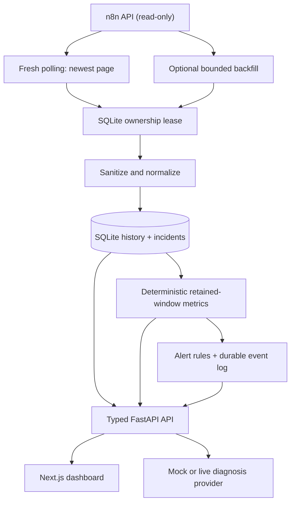

# FlowMedic AI

[](https://github.com/engdareenbassamesleem/flowmedic-ai/actions/workflows/ci.yml)


**AI-powered observability and incident diagnosis for automation workflows.**

FlowMedic turns failed n8n executions into persistent, sanitized incidents and provides
structured AI-assisted diagnosis suggestions for human review. It is designed for
automation engineers, AI engineers, technical operations teams, and agencies managing n8n
workflows.

## The problem

Automation failures can be silent, difficult to trace, and expensive to investigate. Raw
execution payloads may be large or sensitive, while the useful context—what failed, where,
and when—is scattered across workflow and execution data.

## What FlowMedic does today

- Uses **read-only** n8n API calls to check connectivity, list workflows, and inspect recent
  failed executions.
- Normalizes failures into a small, sanitized incident record; repeated syncs do not create
  duplicate incidents for the same execution.
- Persists incidents and their latest diagnosis in SQLite through SQLAlchemy.
- Runs a durable, read-only monitoring loop when n8n credentials are configured. Every cycle
  polls the newest execution page first; a separate bounded cursor backfills older pages without
  delaying fresh failure discovery.
- Derives deterministic workflow health and global metrics from persisted history—not from an
  LLM—and exposes unavailable data as unknown rather than guessing.
- Generates typed, uncertainty-aware diagnosis suggestions using either a deterministic mock
  provider or an OpenAI-compatible structured-output provider.
- Provides a responsive Next.js dashboard for overview, workflows, incidents, incident
  detail, and safe configuration status.
- Records deterministic alert-rule decisions for new incidents, unhealthy workflows, and
  degraded monitoring. The included provider is local/mock only and is disabled until a rule is
  explicitly enabled.

FlowMedic is an investigation aid. It does not modify workflows, apply fixes, or claim that a
diagnosis is certain.

## Product preview

The dashboard is available locally at `http://127.0.0.1:3000` after setup. No screenshots are
committed yet, so this repository intentionally does not show fabricated product imagery.
Add verified captures after running or deploying the dashboard; see
[`docs/screenshots/README.md`](docs/screenshots/README.md) for the expected files.

## Architecture



The dashboard consumes the FastAPI API; it does not call n8n or an AI provider directly.
Diagnosis is advisory output from the configured provider, not an automated repair action.

```text
app/
  api/                 FastAPI routes and dependencies
  integrations/n8n/    Read-only n8n client and upstream schemas
  services/            Failure normalization
  repositories/        Incident persistence and idempotency
  services/monitoring  Polling, retry/backoff, health classification
  ai/                  Diagnosis provider interface and adapters
  schemas/             Public Pydantic response models
  core/                Settings, database, sanitization, and safe errors
frontend/
  app/                 Next.js App Router pages
  components/          Dashboard UI and accessible states
  lib/                 Typed API client, types, formatting, and hooks
tests/                 Offline backend and API tests
```

## Tech stack

| Area | Technologies |
|---|---|
| Backend | Python, FastAPI, Pydantic, SQLAlchemy, SQLite, Alembic, httpx |
| Frontend | Next.js, React, TypeScript, Tailwind CSS |
| AI | Provider abstraction, OpenAI-compatible structured-output adapter, deterministic mock provider |
| Quality | pytest, Ruff, Vitest, ESLint, TypeScript |
| Infrastructure | Docker, Docker Compose, GitHub Actions |

## Engineering decisions

- **Read-only n8n integration:** the client issues API reads only; FlowMedic has no workflow
  write or repair capability.
- **Idempotent ingestion:** incidents are keyed by execution ID, and the repository handles
  duplicate-insert races safely. Execution history has its own source + execution-ID uniqueness
  constraint.
- **Fresh-first cursor strategy:** every scheduled cycle reads n8n's newest page with no cursor.
  A separate opaque backfill cursor advances older pages in bounded work; no execution-ID ordering
  is assumed and repeated newest-page reads are safe through database uniqueness.
- **Multi-process ownership lease:** SQLite stores an expiring, refreshable lease. A local async
  lock prevents overlap in one process, while the lease safely contends across processes and
  recovers after a crash or expiry.
- **Bounded retention:** execution history is deleted in configured batches after its retention
  window; incidents and checkpoints are never deleted by that cleanup.
- **Safe operational logs:** concise events cover fresh polls, backfill, lease contention/recovery,
  retries, and retention counts without recording API keys, credentials, or execution payloads.
- **Bounded recovery:** timeouts, connectivity failures, rate limits, and n8n 5xx responses
  receive bounded exponential retries; authentication and configuration errors do not.
- **Sanitized failure context:** the normalizer deliberately excludes execution `runData`, node
  inputs/outputs, credentials, and the raw upstream error object.
- **Typed public API:** FastAPI response models define workflow, failure, incident, diagnosis,
  configuration-status, and error shapes.
- **Provider abstraction:** the diagnosis path supports a deterministic mock and a configurable
  OpenAI-compatible provider with strict JSON-schema output.
- **Explicit uncertainty:** confidence is shown as a provider estimate, not a calibrated
  probability; suggested fixes require review.
- **Independent delivery checks:** CI runs Python checks on Python 3.12 and 3.13, frontend
  lint/typecheck/tests/build, and separate backend and dashboard Docker builds.
- **Local-first alerting:** rules are disabled by default. Trigger state, cooldown windows,
  event deduplication, and delivery attempts are persisted; the supplied mock provider records
  delivery locally and never sends a message or webhook.

## Safety & reliability

- FlowMedic never automatically modifies n8n workflows.
- Diagnosis suggestions require human review before any production change.
- API responses do not return configured API keys, connection strings, upstream response
  bodies, or stack traces.
- Sensitive values are sanitized before failure context is persisted or passed to a diagnosis
  provider.
- Demo mode contains one fixed synthetic incident and mock diagnosis only; it never contacts
  n8n or a live AI provider. It also seeds a clearly synthetic healthy, degraded, and unhealthy
  workflow history for the dashboard.
- Offline tests and CI use mocked n8n/AI HTTP interactions, so real credentials are not
  required. Optional live n8n validation is opt-in and never runs in CI.
- Alert delivery is at-least-once from FlowMedic's perspective: durable event keys and attempt
  records reduce duplicates, but exactly-once delivery cannot be guaranteed without cooperation
  from a future external provider.

## Local development

### 1. Start the FastAPI backend

```bash
git clone https://github.com/engdareenbassamesleem/flowmedic-ai.git
cd flowmedic-ai
python -m venv .venv
# Linux/macOS
source .venv/bin/activate
# Windows PowerShell: .\.venv\Scripts\Activate.ps1
python -m pip install -e ".[dev]"
cp .env.example .env
python -m uvicorn app.main:app --host 127.0.0.1 --port 8000 --no-access-log
```

### 2. Start the dashboard

In a second terminal:

```bash
cd flowmedic-ai/frontend
cp .env.example .env.local
npm ci
npm run dev
```

Open `http://127.0.0.1:3000`. The frontend defaults to
`http://127.0.0.1:8000`; set `NEXT_PUBLIC_API_BASE_URL` in `.env.local` to use another
backend address. It is browser-visible configuration and must not contain a token or secret.

### Environment variables

| Variable | Default | Purpose |
|---|---|---|
| `N8N_BASE_URL` | unset | Required for n8n reads; URL with no credentials embedded |
| `N8N_API_KEY` | empty | Required for n8n reads; never returned through the API |
| `DATABASE_URL` | `sqlite:///./flowmedic.db` | SQLAlchemy database connection |
| `AI_API_KEY` | empty | Selects a live compatible provider; empty uses the mock provider |
| `AI_BASE_URL` | `https://api.openai.com/v1` | Trusted OpenAI-compatible provider base URL |
| `AI_MODEL` | `gpt-4.1-mini` | Model expected to support strict JSON-schema output |
| `FLOWMEDIC_API_KEY` | empty | Optional bearer token for routes other than `/health` |
| `DEMO_MODE` | `false` | Enables the synthetic, credentials-free demo; cannot be combined with n8n or AI keys |
| `CORS_ALLOW_ORIGINS` | local dashboard origins | Comma-separated frontend origins permitted by FastAPI |
| `MONITOR_POLL_INTERVAL_SECONDS` | `60` | Read-only polling cadence; 10–3600 seconds |
| `MONITOR_PAGE_SIZE` | `50` | n8n execution page size; 1–100 |
| `MONITOR_BACKFILL_PAGES_PER_CYCLE` | `1` | Bounded older-page work after the fresh poll; 0 disables backfill |
| `MONITOR_LEASE_SECONDS` | `120` | SQLite lease expiry for cross-process polling ownership |
| `MONITOR_MAX_RETRIES` | `3` | Maximum transient retry attempts per poll |
| `MONITOR_RETRY_BASE_SECONDS` | `2` | Initial exponential-backoff delay |
| `EXECUTION_HISTORY_RETENTION_DAYS` | `30` | Retained execution-history window; incidents are not deleted |
| `RETENTION_CLEANUP_INTERVAL_SECONDS` | `86400` | Minimum interval between retention cleanup attempts |
| `RETENTION_CLEANUP_BATCH_SIZE` | `500` | Maximum history records deleted in one cleanup run |
| `ALERT_DEFAULT_COOLDOWN_SECONDS` | `300` | Suggested cooldown when creating an alert rule; 60–86400 seconds |
| `ALERT_MAX_RETRIES` | `3` | Maximum persisted attempts for one mock alert event |
| `NEXT_PUBLIC_API_BASE_URL` | `http://127.0.0.1:8000` | Frontend-only API base URL in `frontend/.env.local` |

Without n8n credentials, local health and incident endpoints still work; n8n operations return
a safe configuration error.

## Demo mode

Demo mode makes the full dashboard flow inspectable without n8n or AI credentials. It seeds
one persistent, clearly synthetic workflow failure, a deterministic mock diagnosis, and small
synthetic execution histories that exercise healthy, degraded, and unhealthy dashboard states.

```bash
DEMO_MODE=true DATABASE_URL=sqlite:///./flowmedic-demo.db \
  python -m uvicorn app.main:app --host 127.0.0.1 --port 8000 --no-access-log
```

Then start the dashboard as above. Do not use demo mode with `N8N_API_KEY` or `AI_API_KEY`.

## API

Interactive OpenAPI documentation is available at `http://127.0.0.1:8000/docs` when optional
bearer authentication is disabled.

| Method | Path | Purpose |
|---|---|---|
| `GET` | `/health` | Local process liveness; does not probe n8n |
| `GET` | `/api/v1/system/status` | Safe configuration state only |
| `GET` | `/api/v1/n8n/status` | Check n8n read access |
| `GET` | `/api/v1/monitoring/status` | Safe polling state and durable checkpoint summary |
| `POST` | `/api/v1/monitoring/sync` | Run fresh polling plus bounded idempotent backfill |
| `GET` | `/api/v1/metrics/overview` | Persisted global workflow-health metrics |
| `GET` | `/api/v1/metrics/workflows` | Persisted health metrics for monitored workflows |
| `GET` | `/api/v1/workflows/{workflow_id}/health` | One workflow's deterministic health state |
| `GET` | `/api/v1/workflows` | Sanitized workflow summaries with cursor pagination |
| `GET` | `/api/v1/executions/failed` | Normalized failures from a recent execution page |
| `POST` | `/api/v1/incidents/sync` | Explicitly ingest failures into persistent incidents |
| `GET` | `/api/v1/incidents` | List persisted incidents with offset pagination |
| `GET` | `/api/v1/incidents/{incident_id}` | Read one incident |
| `POST` | `/api/v1/incidents/{incident_id}/diagnose` | Generate and persist an advisory diagnosis |
| `GET`, `POST`, `PATCH` | `/api/v1/alerts/rules` | View or explicitly configure local/mock alert rules |
| `GET` | `/api/v1/alerts/events` | View persisted alert-event history |
| `GET` | `/api/v1/alerts/events/{event_id}/deliveries` | View safe, persisted delivery attempts |
| `GET` | `/api/v1/demo` | Synthetic demo metadata; available only with `DEMO_MODE=true` |

`GET` endpoints do not ingest incidents. The monitoring `POST` is read-only toward n8n and
uses the same idempotent service as the background loop. Error responses use the safe shape
`{"error":{"code":"...","message":"..."}}`.

### Health rules

Health uses each workflow's latest 20 persisted execution records:

- **Unknown:** no classified success/failure history is available.
- **Healthy:** classified executions contain no failures and no open incidents.
- **Degraded:** a recent failure or open incident exists, but the unhealthy rules do not.
- **Unhealthy:** two or more recent failures, a failure with no recent success, or two or more
  open incidents exist.

The global success/failure counts use the latest 100 persisted records. With retention enabled,
all rates and health states are calculated from retained history, not lifetime data. These are
deterministic rules and not AI-generated judgments.

## Live n8n validation

CI is intentionally offline. To validate a real, non-production n8n instance locally, set
`N8N_BASE_URL` and `N8N_API_KEY` in `.env`, then explicitly opt in:

```bash
RUN_LIVE_N8N_VALIDATION=true python -m pytest -q -m integration
```

Use a harmless test workflow and create one normal run plus one controlled failure, such as an
HTTP Request node pointed at a deliberately nonexistent test URL, a missing expected test field,
or a controlled mock-endpoint failure. Then call `POST /api/v1/monitoring/sync`, inspect
`GET /api/v1/monitoring/status` and the dashboard history metrics, and run the same sync again
to confirm that history and incidents are not duplicated. The test and API only read n8n; they
never trigger, replay, modify, or repair a workflow. Do not commit `.env` or credentials.

## Docker Compose

```bash
cp .env.example .env
docker compose up --build
```

Compose binds the API and dashboard to localhost, persists SQLite in a named volume, and runs
the API image as a non-root user. The API is available at `http://127.0.0.1:8000` and the
dashboard at `http://127.0.0.1:3000`.

## Testing and CI

```bash
# Backend
alembic upgrade head
python -m pytest -q
python -m ruff check .
python -m ruff format --check .

# Frontend
cd frontend
npm run lint
npm run typecheck
npm test
npm run build
```

The GitHub Actions workflow is named **FlowMedic checks** and contains `backend`, `frontend`,
and `docker` jobs. The backend job validates `alembic upgrade head` before tests. It runs on
push and pull request.

## Roadmap

**Completed**

- Core FastAPI backend and typed API
- Incident persistence with idempotent ingestion
- AI diagnosis provider abstraction and deterministic demo mode
- SaaS-style Next.js dashboard
- Durable monitoring, checkpoints, retry/backoff, and execution history
- Fresh-first polling, bounded backfill, SQLite ownership leasing, and retention
- Deterministic workflow health and monitoring metrics
- Local-first alert-rule, cooldown, deduplication, and durable delivery-attempt foundation

**Next**

- Configured external alert providers and notification delivery
- Deeper diagnosis evaluation
- Audit history

**Later**

- Alerting
- Safe repair suggestions
- Additional automation-platform integrations
- Multi-tenancy and billing

## License

No license file is currently included. Choose a license before inviting external reuse or
contributions; MIT is a simple permissive option, while retaining no license keeps reuse
rights reserved by default.

## Reviewer entry points

For a short code tour, start with app/services/health.py (deterministic rules), app/integrations/n8n/client.py (upstream API boundary) and tests/test_monitoring.py (monitoring behavior). Use the documented synthetic demo to inspect the system before configuring live integrations. This is a portfolio implementation; the README's test commands are reproducible checks, not a claim that every deployment has been validated.
