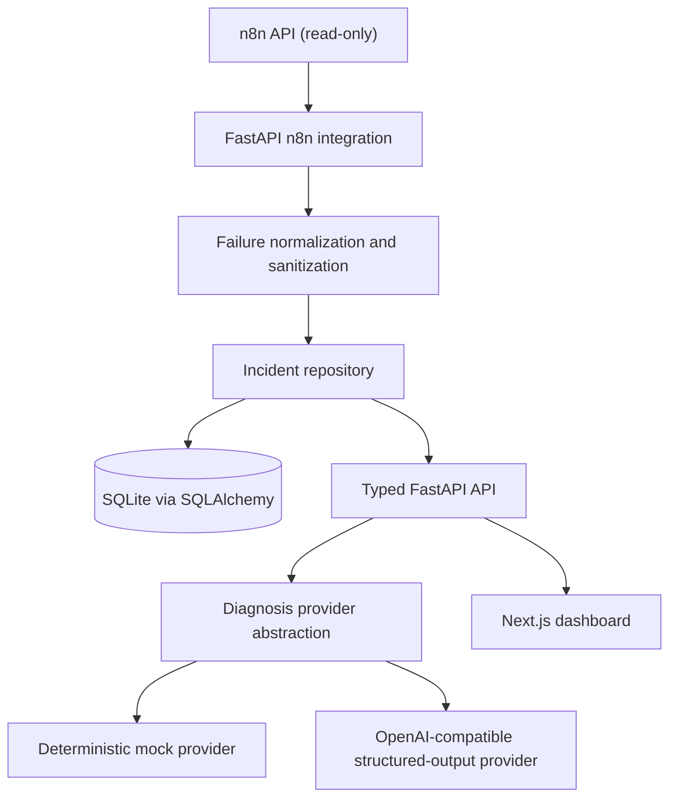

# FlowMedic AI

[](https://github.com/engdareenbassamesleem/flowmedic-ai/actions/workflows/ci.yml)


**AI-powered observability and incident diagnosis for automation workflows.**

FlowMedic turns failed n8n executions into persistent, sanitized incidents and provides
structured AI-assisted diagnosis suggestions for human review. It is designed for
automation engineers, AI engineers, technical operations teams, and agencies managing n8n
workflows.

## The problem

Automation failures can be silent, difficult to trace, and expensive to investigate. Raw
execution payloads may be large or sensitive, while the useful context—what failed, where,
and when—is scattered across workflow and execution data.

## What FlowMedic does today

- Uses **read-only** n8n API calls to check connectivity, list workflows, and inspect recent
  failed executions.
- Normalizes failures into a small, sanitized incident record; repeated syncs do not create
  duplicate incidents for the same execution.
- Persists incidents and their latest diagnosis in SQLite through SQLAlchemy.
- Generates typed, uncertainty-aware diagnosis suggestions using either a deterministic mock
  provider or an OpenAI-compatible structured-output provider.
- Provides a responsive Next.js dashboard for overview, workflows, incidents, incident
  detail, and safe configuration status.

FlowMedic is an investigation aid. It does not modify workflows, apply fixes, or claim that a
diagnosis is certain.

## Product preview

The dashboard is available locally at `http://127.0.0.1:3000` after setup. No screenshots are
committed yet, so this repository intentionally does not show fabricated product imagery.
Add verified captures after running or deploying the dashboard; see
[`docs/screenshots/README.md`](docs/screenshots/README.md) for the expected files.

## Architecture



The dashboard consumes the FastAPI API; it does not call n8n or an AI provider directly.
Diagnosis is advisory output from the configured provider, not an automated repair action.

```text
app/
  api/                 FastAPI routes and dependencies
  integrations/n8n/    Read-only n8n client and upstream schemas
  services/            Failure normalization
  repositories/        Incident persistence and idempotency
  ai/                  Diagnosis provider interface and adapters
  schemas/             Public Pydantic response models
  core/                Settings, database, sanitization, and safe errors
frontend/
  app/                 Next.js App Router pages
  components/          Dashboard UI and accessible states
  lib/                 Typed API client, types, formatting, and hooks
tests/                 Offline backend and API tests
```

## Tech stack

| Area | Technologies |
|---|---|
| Backend | Python, FastAPI, Pydantic, SQLAlchemy, SQLite, httpx |
| Frontend | Next.js, React, TypeScript, Tailwind CSS |
| AI | Provider abstraction, OpenAI-compatible structured-output adapter, deterministic mock provider |
| Quality | pytest, Ruff, Vitest, ESLint, TypeScript |
| Infrastructure | Docker, Docker Compose, GitHub Actions |

## Engineering decisions

- **Read-only n8n integration:** the client issues API reads only; FlowMedic has no workflow
  write or repair capability.
- **Idempotent ingestion:** incidents are keyed by execution ID, and the repository handles
  duplicate-insert races safely.
- **Sanitized failure context:** the normalizer deliberately excludes execution `runData`, node
  inputs/outputs, credentials, and the raw upstream error object.
- **Typed public API:** FastAPI response models define workflow, failure, incident, diagnosis,
  configuration-status, and error shapes.
- **Provider abstraction:** the diagnosis path supports a deterministic mock and a configurable
  OpenAI-compatible provider with strict JSON-schema output.
- **Explicit uncertainty:** confidence is shown as a provider estimate, not a calibrated
  probability; suggested fixes require review.
- **Independent delivery checks:** CI runs Python checks on Python 3.12 and 3.13, frontend
  lint/typecheck/tests/build, and separate backend and dashboard Docker builds.

## Safety & reliability

- FlowMedic never automatically modifies n8n workflows.
- Diagnosis suggestions require human review before any production change.
- API responses do not return configured API keys, connection strings, upstream response
  bodies, or stack traces.
- Sensitive values are sanitized before failure context is persisted or passed to a diagnosis
  provider.
- Demo mode contains one fixed synthetic incident and mock diagnosis only; it never contacts
  n8n or a live AI provider.
- Offline tests and CI use mocked n8n/AI HTTP interactions, so real credentials are not
  required.

## Local development

### 1. Start the FastAPI backend

```bash
git clone https://github.com/engdareenbassamesleem/flowmedic-ai.git
cd flowmedic-ai
python -m venv .venv
# Linux/macOS
source .venv/bin/activate
# Windows PowerShell: .\.venv\Scripts\Activate.ps1
python -m pip install -e ".[dev]"
cp .env.example .env
python -m uvicorn app.main:app --host 127.0.0.1 --port 8000 --no-access-log
```

### 2. Start the dashboard

In a second terminal:

```bash
cd flowmedic-ai/frontend
cp .env.example .env.local
npm ci
npm run dev
```

Open `http://127.0.0.1:3000`. The frontend defaults to
`http://127.0.0.1:8000`; set `NEXT_PUBLIC_API_BASE_URL` in `.env.local` to use another
backend address. It is browser-visible configuration and must not contain a token or secret.

### Environment variables

| Variable | Default | Purpose |
|---|---|---|
| `N8N_BASE_URL` | unset | Required for n8n reads; URL with no credentials embedded |
| `N8N_API_KEY` | empty | Required for n8n reads; never returned through the API |
| `DATABASE_URL` | `sqlite:///./flowmedic.db` | SQLAlchemy database connection |
| `AI_API_KEY` | empty | Selects a live compatible provider; empty uses the mock provider |
| `AI_BASE_URL` | `https://api.openai.com/v1` | Trusted OpenAI-compatible provider base URL |
| `AI_MODEL` | `gpt-4.1-mini` | Model expected to support strict JSON-schema output |
| `FLOWMEDIC_API_KEY` | empty | Optional bearer token for routes other than `/health` |
| `DEMO_MODE` | `false` | Enables the synthetic, credentials-free demo; cannot be combined with n8n or AI keys |
| `CORS_ALLOW_ORIGINS` | local dashboard origins | Comma-separated frontend origins permitted by FastAPI |
| `NEXT_PUBLIC_API_BASE_URL` | `http://127.0.0.1:8000` | Frontend-only API base URL in `frontend/.env.local` |

Without n8n credentials, local health and incident endpoints still work; n8n operations return
a safe configuration error.

## Demo mode

Demo mode makes the full dashboard flow inspectable without n8n or AI credentials. It seeds
one persistent, clearly synthetic workflow failure and uses the deterministic mock provider.

```bash
DEMO_MODE=true DATABASE_URL=sqlite:///./flowmedic-demo.db \
  python -m uvicorn app.main:app --host 127.0.0.1 --port 8000 --no-access-log
```

Then start the dashboard as above. Do not use demo mode with `N8N_API_KEY` or `AI_API_KEY`.

## API

Interactive OpenAPI documentation is available at `http://127.0.0.1:8000/docs` when optional
bearer authentication is disabled.

| Method | Path | Purpose |
|---|---|---|
| `GET` | `/health` | Local process liveness; does not probe n8n |
| `GET` | `/api/v1/system/status` | Safe configuration state only |
| `GET` | `/api/v1/n8n/status` | Check n8n read access |
| `GET` | `/api/v1/workflows` | Sanitized workflow summaries with cursor pagination |
| `GET` | `/api/v1/executions/failed` | Normalized failures from a recent execution page |
| `POST` | `/api/v1/incidents/sync` | Explicitly ingest failures into persistent incidents |
| `GET` | `/api/v1/incidents` | List persisted incidents with offset pagination |
| `GET` | `/api/v1/incidents/{incident_id}` | Read one incident |
| `POST` | `/api/v1/incidents/{incident_id}/diagnose` | Generate and persist an advisory diagnosis |
| `GET` | `/api/v1/demo` | Synthetic demo metadata; available only with `DEMO_MODE=true` |

`GET` endpoints do not ingest incidents. Error responses use the safe shape
`{"error":{"code":"...","message":"..."}}`.

## Docker Compose

```bash
cp .env.example .env
docker compose up --build
```

Compose binds the API and dashboard to localhost, persists SQLite in a named volume, and runs
the API image as a non-root user. The API is available at `http://127.0.0.1:8000` and the
dashboard at `http://127.0.0.1:3000`.

## Testing and CI

```bash
# Backend
python -m pytest -q
python -m ruff check .
python -m ruff format --check .

# Frontend
cd frontend
npm run lint
npm run typecheck
npm test
npm run build
```

The GitHub Actions workflow is named **FlowMedic checks** and contains `backend`, `frontend`,
and `docker` jobs. It runs on push and pull request.

## Roadmap

**Completed**

- Core FastAPI backend and typed API
- Incident persistence with idempotent ingestion
- AI diagnosis provider abstraction and deterministic demo mode
- SaaS-style Next.js dashboard

**Next**

- Durable monitoring/polling
- Historical workflow-health metrics
- Retry/backoff handling
- Durable checkpoints

**Later**

- Alerting
- Safe repair suggestions
- Additional automation-platform integrations
- Multi-tenancy and billing

## License

No license file is currently included. Choose a license before inviting external reuse or
contributions; MIT is a simple permissive option, while retaining no license keeps reuse
rights reserved by default.
